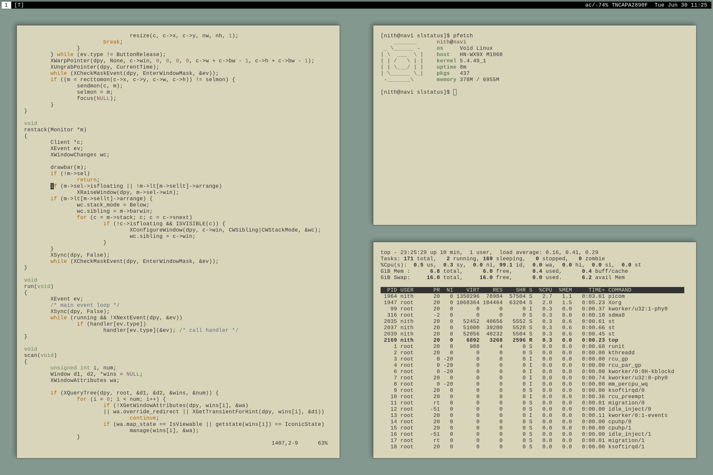

# About me

I am a Computer Security Student, who has a passion for all things Linux & unix.

I am a currently using and learning POSIX shell and C, I will be using these for most of the projects and I will hopefully be using this website to document about.

I have a interest a strong interest in software minimalism, suckless and plan 9.

My current setup is on a Huawei Matebook 13 AMD with Void linux, running DWM as my window Manager and st as my terminal.

I would be using OpenBSD instead but sadly the wifi card and trackpad are not supported at the moment.

### Here is a screenshot of my current setup

